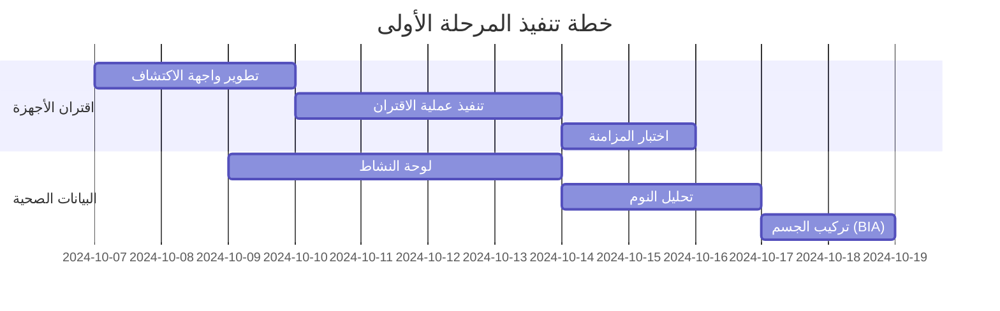
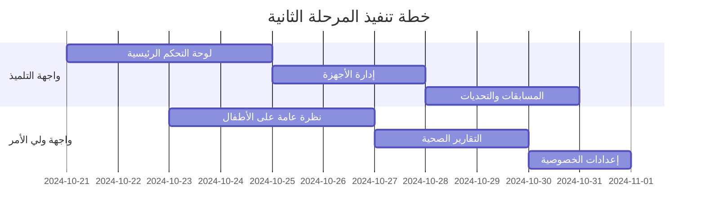
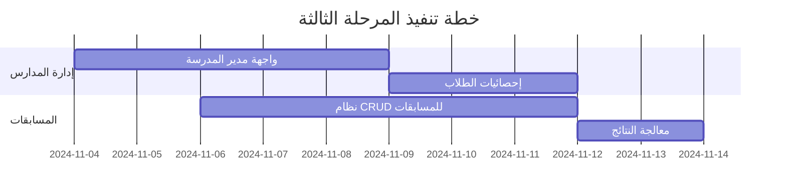

# أولويات التنفيذ التسليمية (Implementation Priorities)

## نظرة عامة
هذا المستند يحدد الأولويات التنفيذية للمشروع بناءً على الأهمية الوظيفية وقابلية التسليم، مع التركيز على الاتساق بين الواجهات والمزامنة بين الأدوار.

## المرحلة الأولى: الأساسيات الحيوية (4 أسابيع)
### الأولوية 1: الاقتران والمزامنة وعرض البيانات الصحية

#### 1.1 نظام اقتران الأجهزة
**المكونات المطلوبة:**
```typescript
// مكونات الاقتران الأساسية
src/components/devices/
├── DeviceDiscovery.tsx          // اكتشاف الأجهزة
├── DevicePairing.tsx            // عملية الاقتران
├── PairingConfirmation.tsx      // تأكيد الاقتران
├── DeviceStatus.tsx             // حالة الجهاز
└── SyncProgress.tsx             // تقدم المزامنة
```

**المتطلبات التقنية:**
- دعم Bluetooth Web API
- محاكاة أجهزة متعددة (Mi Band, Apple Watch, Samsung)
- رموز اقتران آمنة (6 أرقام)
- تشفير البيانات المنقولة

**معايير القبول:**
- [ ] اكتشاف الأجهزة خلال 10 ثوانٍ
- [ ] اقتران ناجح مع رمز تأكيد
- [ ] عرض حالة البطارية والاتصال
- [ ] مزامنة تلقائية كل 15 دقيقة

#### 1.2 عرض البيانات الصحية
**لوحات المعلومات المطلوبة:**
```typescript
src/components/health/
├── ActivityDashboard.tsx        // لوحة النشاط الرئيسية
├── StepsCounter.tsx             // عداد الخطوات
├── CaloriesDisplay.tsx          // عرض السعرات
├── HeartRateMonitor.tsx         // مراقب القلب
├── SleepAnalysis.tsx            // تحليل النوم
└── BIAComposition.tsx           // تركيب الجسم (شرطي)
```

**ميزات البيانات:**
- عرض البيانات بالوقت الفعلي
- رسوم بيانية تفاعلية (Chart.js)
- مقارنات يومية/أسبوعية/شهرية
- تصدير البيانات الشخصية

#### 1.3 المزامنة الذكية
**خوارزمية المزامنة:**
```typescript
// منطق المزامنة التلقائية
interface SyncStrategy {
  interval: number;           // كل 15 دقيقة
  retryAttempts: number;     // 3 محاولات
  batchSize: number;         // 100 نقطة بيانات
  priorityData: string[];    // [steps, heart_rate, sleep]
}
```

**حالات المزامنة:**
- مزامنة فورية عند الاتصال
- مزامنة دورية في الخلفية
- مزامنة يدوية عند الطلب
- استرداد البيانات المفقودة

---

## المرحلة الثانية: الواجهات الأساسية (3 أسابيع)
### الأولوية 2: صفحات التلميذ والطالب وولي الأمر والمدرب

#### 2.1 واجهة التلميذ/الطالب
**الصفحات الأساسية:**
```typescript
src/pages/student/
├── StudentDashboard.tsx         // لوحة التحكم الرئيسية
├── MyDevices.tsx               // أجهزتي
├── HealthMetrics.tsx           // مقاييسي الصحية
├── TrainingSchedule.tsx        // جدول التدريب
├── Competitions.tsx            // المسابقات
├── Messages.tsx                // الرسائل
└── Profile.tsx                 // الملف الشخصي
```

**المميزات الخاصة:**
- تخصيص لوحة التحكم
- تحديات شخصية
- مقارنة مع الأصدقاء
- إنجازات ونقاط

#### 2.2 واجهة ولي الأمر
**الصفحات المطلوبة:**
```typescript
src/pages/parent/
├── ParentDashboard.tsx          // نظرة عامة على الأطفال
├── ChildProgress.tsx            // تقدم الطفل
├── HealthReports.tsx            // التقارير الصحية
├── SchoolCommunication.tsx      // التواصل مع المدرسة
├── ConsentManagement.tsx        // إدارة الموافقات
├── AppointmentBooking.tsx       // حجز المواعيد
└── PrivacySettings.tsx          // إعدادات الخصوصية
```

**الربط مع التلميذ:**
- عرض بيانات متعددة الأطفال
- إشعارات فورية للتغييرات
- تقارير أسبوعية تلقائية
- موافقة على المشاركة في المسابقات

#### 2.3 واجهة المدرب
**الصفحات التخصصية:**
```typescript
src/pages/coach/
├── CoachDashboard.tsx           // لوحة المدرب
├── StudentManagement.tsx        // إدارة الطلاب
├── SessionPlanning.tsx          // تخطيط الحصص
├── PerformanceAnalysis.tsx      // تحليل الأداء
├── TrainingPrograms.tsx         // البرامج التدريبية
├── BookingCalendar.tsx          // تقويم الحجوزات
└── ProgressReports.tsx          // تقارير التقدم
```

**أدوات التدريب:**
- إنشاء برامج تدريبية مخصصة
- تتبع أداء المجموعات
- جدولة الحصص التلقائية
- تقييم التقدم الفردي

#### 2.4 المزامنة بين الأدوار
**نظام الربط:**
```typescript
// مثال على الربط بين الأدوار
interface RoleConnection {
  student: {
    parents: string[];           // أولياء الأمور
    teachers: string[];          // المعلمون
    coaches: string[];           // المدربون
  };
  
  parent: {
    children: string[];          // الأطفال
    notifications: NotificationType[];
  };
  
  coach: {
    students: string[];          // الطلاب المدربون
    sessions: TrainingSession[];
  };
}
```

---

## المرحلة الثالثة: الإدارة والمسابقات (3 أسابيع)
### الأولوية 3: إدارة المدارس/المديريات/الوزارة/المسابقات

#### 3.1 إدارة المدارس
**واجهة مدير المدرسة:**
```typescript
src/pages/principal/
├── SchoolOverview.tsx           // نظرة عامة على المدرسة
├── StudentStatistics.tsx       // إحصائيات الطلاب
├── TeacherManagement.tsx        // إدارة المعلمين
├── ResourceAllocation.tsx       // توزيع الموارد
├── CompetitionApproval.tsx      // موافقة المسابقات
└── SchoolReports.tsx            // تقارير المدرسة
```

#### 3.2 إدارة المديريات
**واجهة مدير المديرية:**
```typescript
src/pages/directorate/
├── ProvinceOverview.tsx         // نظرة عامة على الولاية
├── SchoolsManagement.tsx        // إدارة المدارس
├── RegionalStatistics.tsx       // الإحصائيات الإقليمية
├── BudgetAllocation.tsx         // توزيع الميزانية
├── CompetitionCoordination.tsx  // تنسيق المسابقات
└── DirectorateReports.tsx       // تقارير المديرية
```

#### 3.3 إدارة الوزارة
**واجهة مسؤول الوزارة:**
```typescript
src/pages/ministry/
├── NationalDashboard.tsx        // لوحة التحكم الوطنية
├── ProvincialComparison.tsx     // مقارنة الولايات
├── PolicyImplementation.tsx     // تنفيذ السياسات
├── NationalCompetitions.tsx     // المسابقات الوطنية
├── PerformanceMetrics.tsx       // مقاييس الأداء الوطني
└── StrategicPlanning.tsx        // التخطيط الاستراتيجي
```

#### 3.4 نظام المسابقات الشامل
**إدارة المسابقات (CRUD):**
```typescript
src/components/competitions/
├── CompetitionCreator.tsx       // إنشاء مسابقة
├── CompetitionEditor.tsx        // تعديل المسابقة
├── CompetitionViewer.tsx        // عرض المسابقة
├── CompetitionPublisher.tsx     // نشر المسابقة
├── CompetitionCanceller.tsx     // إلغاء المسابقة
├── ParticipantManager.tsx       // إدارة المشاركين
├── ResultsProcessor.tsx         // معالجة النتائج
└── CompetitionExporter.tsx      // تصدير البيانات
```

**أنواع المسابقات:**
- تحديات اللياقة البدنية
- مسابقات الجري والمشي
- تحديات الفرق
- مسابقات التحمل
- تحديات القوة والمرونة

---

## المرحلة الرابعة: التجارة والتقارير (2 أسابيع)
### الأولوية 4: المتجر والتقارير

#### 4.1 نظام المتجر
**مكونات المتجر:**
```typescript
src/components/store/
├── ProductCatalog.tsx           // كتالوج المنتجات
├── ProductDetails.tsx           // تفاصيل المنتج
├── ShoppingCart.tsx             // سلة التسوق
├── CheckoutProcess.tsx          // عملية الدفع
├── OrderTracking.tsx            // تتبع الطلبات
├── PaymentGateway.tsx           // بوابة الدفع
└── InventoryManager.tsx         // إدارة المخزون
```

**فئات المنتجات:**
- أجهزة اللياقة البدنية
- الملابس الرياضية
- المكملات الغذائية
- الكتب والمواد التعليمية
- الاكسسوارات الرياضية

#### 4.2 نظام التقارير الشامل
**مولد التقارير:**
```typescript
src/components/reports/
├── ReportBuilder.tsx            // بناء التقارير
├── ReportTemplates.tsx          // قوالب التقارير
├── DataVisualization.tsx        // تصور البيانات
├── ExportManager.tsx            // إدارة التصدير
├── EmailSender.tsx              // إرسال البريد
├── ScheduledReports.tsx         // التقارير المجدولة
└── ReportAnalytics.tsx          // تحليل التقارير
```

**أنواع التقارير:**
- تقارير الأداء الفردي
- تقارير الصف/المدرسة
- تقارير الولاية/الوطنية
- تقارير المسابقات
- تقارير استخدام الأجهزة

---

## المرحلة الخامسة: التحسينات والتطوير (2 أسابيع)
### الأولوية 5: تحسينات UI/UX

#### 5.1 تحسينات الواجهة
**التحسينات المرئية:**
- رسوم متحركة سلسة
- انتقالات ناعمة بين الصفحات
- تأثيرات بصرية جذابة
- تحسين الألوان والخطوط
- أيقونات مخصصة

#### 5.2 تحسينات تجربة المستخدم
**تحسينات التفاعل:**
- اختصارات لوحة المفاتيح
- سحب وإفلات
- إيماءات اللمس
- بحث ذكي
- اقتراحات تلقائية

#### 5.3 الأداء والتحسين
**تحسينات الأداء:**
- تحميل تدريجي للصور
- ضغط البيانات
- تخزين مؤقت ذكي
- تحسين استعلامات قاعدة البيانات
- تقليل حجم الحزم

---

## خطة التنفيذ التفصيلية

### الأسبوع 1-2: اقتران الأجهزة والبيانات الصحية


### الأسبوع 3-4: واجهات المستخدمين الأساسية


### الأسبوع 5-6: الإدارة والمسابقات


---

## معايير الجودة والاختبار

### اختبارات الوحدة (Unit Tests)
```typescript
// مثال على اختبار اقتران الجهاز
describe('Device Pairing', () => {
  test('should discover devices within 10 seconds', async () => {
    const devices = await discoverDevices();
    expect(devices.length).toBeGreaterThan(0);
    expect(devices[0].name).toBeDefined();
  });
  
  test('should pair device with valid code', async () => {
    const result = await pairDevice('device_123', '123456');
    expect(result.success).toBe(true);
    expect(result.device.status).toBe('paired');
  });
});
```

### اختبارات التكامل (Integration Tests)
```typescript
// اختبار المزامنة بين الأدوار
describe('Role Synchronization', () => {
  test('student booking appears in coach calendar', async () => {
    const booking = await createBooking(studentId, coachId, sessionData);
    const coachCalendar = await getCoachCalendar(coachId);
    
    expect(coachCalendar.bookings).toContainEqual(
      expect.objectContaining({
        id: booking.id,
        studentId: studentId
      })
    );
  });
});
```

### اختبارات الأداء (Performance Tests)
- تحميل الصفحة < 2 ثانية
- استجابة API < 500ms
- مزامنة البيانات < 30 ثانية
- دعم 1000 مستخدم متزامن

---

## التسليم والنشر

### مراحل التسليم
1. **Alpha Release** (نهاية الأسبوع 2): اقتران الأجهزة والبيانات الأساسية
2. **Beta Release** (نهاية الأسبوع 4): واجهات المستخدمين الأساسية
3. **Release Candidate** (نهاية الأسبوع 6): جميع الميزات الأساسية
4. **Production Release** (نهاية الأسبوع 8): النسخة النهائية المحسنة

### معايير التسليم
- [ ] جميع الاختبارات تمر بنجاح
- [ ] الأداء يلبي المتطلبات المحددة
- [ ] الواجهات متسقة ومترجمة بالكامل
- [ ] الوثائق مكتملة ومحدثة
- [ ] النظام آمن ويحمي البيانات الشخصية

هذه الخطة تضمن التسليم المتدرج والمنظم مع التركيز على الوظائف الأساسية أولاً، ثم التوسع تدريجياً لتشمل جميع المتطلبات.